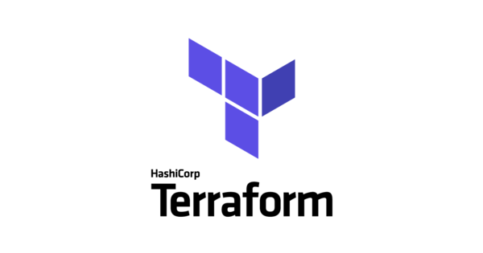
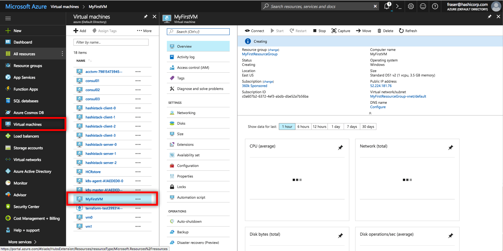
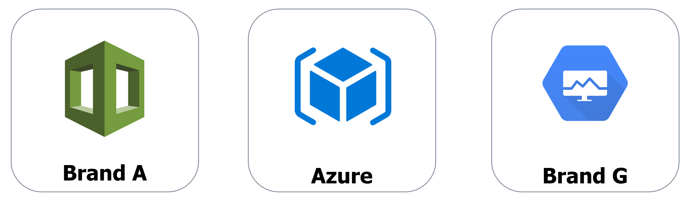
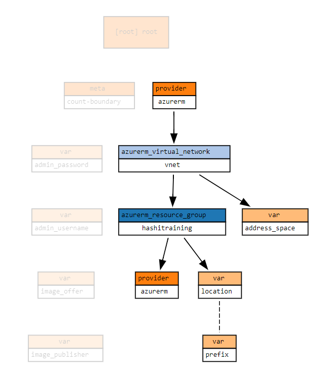

name: Terraform-102
class: center
count: false

<br><br>
## Terraform Associate Preperation
???
Welcome to the preparation guide to Terraform Associate on Azure. This slide deck is written entirely in Markdown language, which means you can make edits or additions, then submit a pull request to add your changes to the master copy. To make edits to the slide deck simply fork this repository, edit the Markdown files, and submit a pull request with your changes.

The Markdown content is contained in the docs/ subdirectories.

Here are some helpful keyboard shortcuts for the instructor or participant:

⬆ ⬇ ⬅ ➡ - Navigate back and forth
P         - Toggle presenter view
C         - Pop an external window for presentation

Instructor notes are included in plain text, narrative parts are in **bold**. You can use the narrative quotes or change them to suit your own presentation style.

---
layout: true

.footer[
- Copyright © 2020 HashiCorp
- 
]

---
name: Introductions
# Introductions
* Your Name
* Job Title
* Automation Experience
* Favorite Text Editor

???
Use this slide to introduce yourself, give a little bit of your background story, then go around the room and have all your participants introduce themselves.

The favorite text editor question is a good ice breaker, but perhaps more importantly it gives you an immediate gauge of how technical your users are.

**There are no wrong answers to this question. Unless you say Notepad. Friends don't let friends write code in Notepad.**

**If you don't have a favorite text editor, that's okay! Our cloud lab has Visual Studio Code preinstalled. VSC is a free programmer's text editor for Microsoft, and it has great Terraform support. Most of this workshop will be simply copying and pasting code, so if you're not a developer don't fret. Terraform is easy to learn and fun to work with.**

---
name: Link-to-Slide-Deck
# The Slide Deck
<br><br><br>
Follow along on your own computer at this link:

# https://chrismatteson.github.io/terraform-102

---
name: Table-of-Contents
# Table of Contents

1. Review Intro to Terraform Materials<br>
1. Additional Depth on Terraform Basics<br>
1. Use the Terraform CLI (Outside of the core workflow)<br>
⚗️ **Lab - Terraform with Kubernetes**<br>
1. Additional Depth on State<br>
1. Additional Depth on "Read, generate, and modify configuration"<br>
1. Additional Depth on Terraform Cloud and Terraform Enterprise Capabilities<br>
Lab
1. Exam Process<br>
⚗️ **Lab - Terraform Module Lab**


???
This workshop should take roughly three-four hours to complete.

**Here is our agenda for today's training. The format is simple, you'll hear a lecture and view slides on each topic, then participate in a hands-on lab about that topic. We'll alternate between lecture and lab, with a couple of breaks thrown in.**

---
name: intro-to-terraform-demo
class: title
# Chapter 1
## Review Intro to Terraform Material

???


---
name: How-to-Provision-a-VM
# How to Provision an Azure VM

Let's look at a few different ways you could provision a new Azure Virtual Machine. Before we start we'll need to gather some basic information including:

* Virtual Machine Name
* Operating System (Image)
* VM Size
* Geographical Location
* Username and Password

???
**Has anyone got experience using Azure? How do most of us normally get started? That's right, we log onto the Azure Portal and start clicking around. All of the major cloud providers make this part really easy. You get your account, log on and start clicking buttons. Let's take a peek at what that looks like...**

We chose the Azure portal as a starting point because most Azure users will be familiar with it. From this familiar starting point we begin our journey...

---
name: Azure-Portal-Provision-2
# Method 1: Azure Portal (GUI)


???
**Once you've chosen your base OS image, you will fill in some more details like the size of the VM, which location you want to run it in, and the initial administrator password. The Azure portal can be handy for spinning up individual VMs and dev or test environments. The good news is it's really easy to spin up infrastructure this way. The bad news is that it doesn't scale, and chances are nobody's keeping track of what got built.**

It's really easy to make a big mess of things if you simply give everyone a portal account and turn them loose in the cloud environment.

---
name: Azure-Resource-Manager
class: compact
# Method 2: ARM Template
```json
{
...
"apiVersion": "2017-03-30",
"type": "Microsoft.Compute/virtualMachines",
"name": "[variables('vmName')]",
"location": "[parameters('location')]",
"dependsOn": [
  "[concat('Microsoft.Network/networkInterfaces/', variables('nicName'))]"
],
"properties": {
  "hardwareProfile": {
    "vmSize": "[parameters('virtualMachineSize')]"
  },
```

ARM templates provide a consistent and reliable way to provision Azure resources. JSON is easy for computers to read, but can be challenging for humans to edit and troubleshoot.

???
**Which brings us to method #2, Azure Resource Manager templates, also known as ARM templates. Have any of you used ARM templates? What's that experience like?**

**ARM templates are written in JSON, which stands for JavaScript Object Notation. It is an open-standard format for transmitting data between computers. And don't get me wrong, JSON is great. If you happen to be a computer. Computers are really good at reading these files full of key-value pairs and lists.**

**The problem is that editing and maintaining huge JSON files is hard for humans. Because JSON is not a programming language, you'll end up writing a lot more lines of complex code that is hard to understand and change.**

**ARM templates - easy for computers to read, hard for humans to troubleshoot and maintain.**

We are not here to bash on ARM templates or any other JSON/YAML based provisioning tools. The simple fact is these data formats are not well suited for logical operations (if/then, for loops, etc.)


---
name: Provision-with-Terraform-2
# Method 3: Provision with Terraform
```terraform
resource "azure_virtual_machine" "web" {
  name     = "MyFirstVM"
  image    = "Windows 2012 R2"
  vm_size  = "Standard DS1"
  location = "East US"
  username = "John Doe"
  password = "YoullNeverGuessThisPassword"
}
```
.center[Example terraform code for building an Azure VM.]

???
**And finally we have option #3, Terraform. Terraform uses a Domain Specific Language, or DSL that is designed to be both human-friendly and machine-readable. This is an example snippet of Terraform code. Now watch as I flip back to the previous slide. Would you rather have to write and maintain this complex and messy JSON, or this simple, compact terraform code?**

Advance back to the previous slide to illustrate the difference between JSON and equivalent Terraform.

---
name: What-is-Terraform
# What is Terraform?
```terraform
resource "azurerm_virtual_machine" "catapp" {
  name                = "${var.prefix}-meow"
  location            = "${var.location}"
  resource_group_name = "${azurerm_resource_group.myresourcegroup.name}"
  vm_size             = "${var.vm_size}"
  network_interface_ids         = ["${azurerm_network_interface.catapp-nic.id}"]
```
* Executable Documentation
* Human and machine readable
* Easy to learn
* Test, share, re-use, automate
* Works on all major cloud providers


???
**So what exactly _is_ Terraform? Terraform is the DNA of your hybrid infrastructure. Terraform code is written in HCL, or HashiCorp Config Language. It is the only programming language designed specifically for provisioning infrastructure on any platform.**

**Do any of you have a wiki or set of runbooks that contain provisioning instructions? Think for a moment about that wiki. Now I want you to imagine the date stamp, when was this thing last edited? Let's say it was four years ago. Do you think maybe something could have changed in the past four years?**

**It sounds funny but the truth is your wiki is the obituary of the last known state of your infrastructure. One of the main reasons to use terraform is because it is self-documenting. The code itself explains every step required to build this infrastructure, and therefore it is always up to date.**

---
name: IaC
# What is Infrastructure as Code?
<br><br><br>
.biglist[
Infrastructure as Code (IaC) is the process of managing and provisioning cloud infrastructure with machine-readable definition files.

**Think of it as executable documentation.**
]

???
**You might be thinking...why can't I just do this by hand? After all the Azure portal is really easy, and I can just stand up my infrastructure manually. Here's why:**

**Terraform ensures that when you build any type of infrastructure that it gets built correctly every single time, exactly the same way. Let's try a thought experiment. If I gave every single one of you the same build document and asked you to set up a server, I guarantee there will be differences in those machines when you hand them over. They may not be major differences, but over time these can pile up and cause all sorts of uncertainty and issues in your environment.**

**When you require hands on keyboards (or mice), and you start making changes and manual steps on your infrastructure, you've lost the automation battle before it even starts. Even a single manual step can slow down your delivery schedule, and introduce unnecessary risk and change to your environments.**

---
name: IaC2
# Infrastructure as Code Allows Us To...
* Provide a codified workflow to create infrastructure
* Change and update existing infrastructure
* Safely test changes using **`terraform plan`** in dry run mode
* Integrate with application code workflows (Git, Azure DevOps, CI/CD tools)
* Provide reusable modules for easy sharing and collaboration
* Enforce security policy and organizational standards
* Enable collaboration between different teams

???
**Now that all your infrastructure is stored in a source code repository, it's very easy for multiple users and teams to collaborate on it. Developer needs a new feature? He or she can easily adjust the source code and send the change back to the operations folks for review. Terraform is a universal language that is understood by both developers and operations teams.**

---
name: IaC-Tools
# Other Infrastructure as Code Tools
.center[]

These tools work well for configuring the operating system and application. They are not purpose-built for provisioning cloud infrastructure and platform services.

???
**Some of you might be thinking, that sounds great but what about this other tool that I use? Why shouldn't I just use Ansible since we already have that? Or my people only do Powershell. These are all great tools. But none of them are specifically designed for provisioning tasks.**

**Chef, Puppet and Ansible all work great in the context of your operating system and applications. It's true that you can do some cloud provisioning with each of these tools, but none of them really work as well as Terraform. And conversely, HashiCorp doesn't have a configuration management tool. Terraform works great with all of these tools.**

---
name: Native-Tools
# Native Cloud Provisioning Tools
.center[]

Each cloud has its own YAML or JSON based provisioning tool.

Terraform can be used across *all* major cloud providers and VM hypervisors.

???
**Every major cloud provider has their own JSON or YAML based provisioning tool. But all of them are written in YAML or JSON. And if you learn one of these systems, guess what, the others are completely different. Now if you want to have a multi-cloud strategy you have to learn three separate provisioning systems. With Terraform you are using the same language, the same simple syntax on all three of these cloud providers.**

---
Name: Terraform-vs-Native
# Terraform vs. Native Tooling
ARM JSON:
```json
"name": "[concat(parameters('PilotServerName'), '-vm')]",
```

Terraform:
```hcl
name = "${var.PilotServerName}-vm"
```

Terraform code (HCL) is easy to learn and easy to read. It is also 50-70% more compact than an equivalent JSON configuration.

???
1Password did a great blog post illustrating the difference between JSON configuration files and Terraform.

https://blog.1password.com/terraforming-1password/

1Password were able to move their entire production infrastructure to Terraform in a few short weeks. Now they can tear down and completely rebuild their production environment in a matter of hours.

---
name: what-is-terraform-oss
class: img-left
# What is Terraform?


Terraform is an open source provisioning tool.

It ships as a single binary which is written in Go. Terraform is cross platform and can run on Linux, Windows, or MacOS.

Installing terraform is easy. You simply download a zip file, unzip it, and run it.

---
name: terraform-command-line
class: col-2
# Terraform Command Line
Terraform is a command line tool.

Terraform commands are either typed in manually or run automatically from a script.

The commands are the same whether you are on Linux or Windows or MacOS.

Terraform has subcommands that perform different actions.

```terraform
# Basic Terraform Commands
terraform version
terraform help
terraform init
terraform plan
terraform apply
terraform destroy
```

---
name: terraform-code
# Terraform Code
```terraform
resource "azurerm_virtual_network" "vnet" {
  name                = "${var.prefix}-vnet"
  location            = "${azurerm_resource_group.myresourcegroup.location}"
  address_space       = ["${var.address_space}"]
  resource_group_name = "${azurerm_resource_group.myresourcegroup.name}"
}
```

Terraform code is based on the [HCL2 toolkit](https://github.com/hashicorp/hcl2). HCL stands for HashiCorp Configuration Language. Terraform code, or simply *terraform* is a declarative language for provisioning infrastructure on any cloud or platform.

---
name: terraform-workspaces
# Terraform Workspaces

A terraform workspace is simply a folder or directory that contains terraform code.

Terraform files always end in either a `*.tf` or `*.tfvars` extension.

Most terraform workspaces contain a minimum of three files:

**main.tf** - Most of your functional code will go here.<br>
**variables.tf** - This file is for storing variables.<br>
**outputs.tf** - Define what is shown at the end of a terraform run.<br>

---
name: terraform-init
# Terraform Init
```tex
*$ terraform init
Initializing the backend...
Initializing provider plugins...
- Checking for available provider plugins...
- Downloading plugin for provider "azurerm" (hashicorp/azurerm) 1.35.0...
...
provider.azurerm: version = "~> 1.35"

Terraform has been successfully initialized!
```
Terraform fetches any required providers and modules and stores them in the .terraform directory. If you add, change or update your modules or providers you will need to run init again.

???
**Terraform has an extendible architecture. You download the core program, terraform, then it fetches plugins and modules that are required for your code.**

---
name: terraform-plan
# Terraform Plan
```tex
*$ terraform plan
An execution plan has been generated and is shown below.
Terraform will perform the following actions:
  # azurerm_resource_group.myresourcegroup will be created
  + resource "azurerm_resource_group" "myresourcegroup" {
      + id       = (known after apply)
      + location = "centralus"
      + name     = "bugsbunny-workshop"
      + tags     = (known after apply)
    }
Plan: 1 to add, 0 to change, 0 to destroy.
```
Preview your changes with `terraform plan` before you apply them.

???
**`terraform plan` is a dry run command. We're not actually building anything yet, Terraform is just telling is what it would do if we ran it for real.**

---
name: defining-variables
# Where are Variables Defined?
Terraform variables are placed in a file called *variables.tf*. Variables can have default settings. If you omit the default, the user will be prompted to enter a value. Here we are *declaring* the variables that we intend to use.

```tex
variable "prefix" {
  description = "This prefix will be included in the name of most resources."
}

variable "location" {
  description = "The region where the virtual network is created."
* default     = "centralus"
}
```

???
**If you're curious where all these variables are defined, you can see them all in the _variables.tf_ file. Here we are simply defining all the available settings, and optionally declaring some default values. These defaults are what terraform will use if your user doesn't override them with their own settings.**

Q. Where could you override these defaults?<br>
A. In the terraform.tfvars file, or optionally on the command line or via environment variables. The most common approach is to use a tfvars file.

---
name: setting-variables
class: col-2
# How are Variables Set?
Once you have some variables defined, you can set and override them in different ways. Here is the level of precedence for each method.

This list goes from highest precedence (1) to lowest (5).

<br>
1. Command line flag - run as a command line switch
1. Configuration file - set in your terraform.tfvars file
1. Environment variable - part of your shell environment
1. Default Config - default value in variables.tf
1. User manual entry - if not specified, prompt the user for entry

---
name: anatomy-of-a-resource
# Anatomy of a Resource
Every terraform resource is structured exactly the same way.
```terraform
resource "type" "name" {
  parameter = "foo"
  parameter2 = "bar"
  list = ["one", "two", "three"]
}
```
**resource** = Top level keyword<br>
**type** = Type of resource. Example: `azurerm_virtual_machine`.<br>
**name** = Arbitrary name to refer to this resource. Used internally by terraform. This field *cannot* be a variable.

???
Everything else you want to configure within the resource is going to be sandwiched between the curly braces. These can include strings, lists, and maps.

---
name: provider-block
# Terraform Provider Configuration
The terraform core program requires at least one provider to build anything.

You can manually configure which version(s) of a provider you would like to use. If you leave this option out, Terraform will default to the latest available version of the provider.

```hcl
provider "azurerm" {
  version = "=1.35.0"
}
```

---
name: resources-building-blocks
# Resources - Terraform Building Blocks
```hcl
resource "azurerm_resource_group" "hashitraining" {
  name     = "${var.prefix}-workshop"
  location = "${var.location}"
}
```

Here is the first resource we'll be building in the next lab. The variables will be replaced with your own settings or default values.

Terraform is easy to work with. You can test your code as you write it.

Simply keep adding more building blocks until your infrastructure is complete.

???
**Try commenting out this code, then uncommenting it. This is the easy way to write code. Just highlight, uncomment, save the file.**

**Resources are the smallest building blocks of Terraform. Think of them as declarative statements about what you want to build. Save the main.tf file.**

**Note that the resource contains references to the two variables we set in the previous chapter, location and prefix. These will be replaced when we run terraform commands. Variables are always enclosed in a dollar sign and curly braces.**

---
name: terraform-apply
class: compact
# Terraform Apply
```tex
*$ terraform apply
An execution plan has been generated and is shown below.

Terraform will perform the following actions:
  # azurerm_resource_group.myresourcegroup will be created
  + resource "azurerm_resource_group" "myresourcegroup" {
      + id       = (known after apply)
      + location = "centralus"
      + name     = "seanc-workshop"
      + tags     = (known after apply)
    }

Plan: 1 to add, 0 to change, 0 to destroy.
```
`terraform apply` runs a plan and then if you approve, it applies the changes.

---
name: terraform-destroy
class: compact
# Terraform Destroy
```tex
*$ terraform destroy
An execution plan has been generated and is shown below.

Terraform will perform the following actions:

  # azurerm_resource_group.myresourcegroup will be destroyed
  - resource "azurerm_resource_group" "myresourcegroup" {
      - id       = "/subscriptions/14692f20-9428-451b-8298-102ed4e39c2a/resourceGroups/seanc-workshop" -> null
      - location = "centralus" -> null
      - name     = "seanc-workshop" -> null
      - tags     = {} -> null
    }

Plan: 0 to add, 0 to change, 1 to destroy.
```
`terraform destroy` does the opposite. If you approve, your infrastructure is destroyed.
???
**Terraform can just as easily destroy infrastructure as create it. With great power comes great responsibility!**

---
name: terraform-fmt
# Terraform Format
Terraform comes with a built in code formatter/cleaner. It can make all your margins and list indentation neat and tidy. Beauty works better.

```tex
terraform fmt
```

Simply run it in a directory containing *.tf files and it will tidy up your code for you.

---
name: dependency-mapping
class: compact
# Terraform Dependency Mapping
Terraform can automatically keep track of dependencies for you. Look at the two resources below. Note the highlighted line in the azurerm_virtual_network resource. This is how we tell one resource to refer to another in terraform.

```terraform
resource "azurerm_resource_group" "hashitraining" {
  name     = "${var.prefix}-vault-workshop"
  location = "${var.location}"
}

resource "azurerm_virtual_network" "vnet" {
  name                = "${var.prefix}-vnet"
  location            = "${azurerm_resource_group.hashitraining.location}"
  address_space       = ["${var.address_space}"]
* resource_group_name = "${azurerm_resource_group.hashitraining.name}"
}
```

---
name: organizing-your-terraform
# Organize Your Terraform Code
Terraform will read any file in your workspace that ends in a `.tf` extension, but the convention is to have a main.tf, variables.tf, and outputs.tf. You may add more tf files if you wish.

```bash
main.tf
variables.tf
outputs.tf
```

Let's take a closer look at each of these files.

---
name: terraform-main
class: compact
# The Main File

The first file is called main.tf. This is where you normally store your terraform code. With larger, more complex infrastructure you might break this up across several files.

```bash
# This is the main.tf file.
resource "azurerm_resource_group" "hashitraining" {
  name     = "${var.prefix}-vault-workshop"
  location = "${var.location}"
}

resource "azurerm_virtual_network" "vnet" {
  name                = "${var.prefix}-vnet"
  location            = "${azurerm_resource_group.hashitraining.location}"
  address_space       = ["${var.address_space}"]
  resource_group_name = "${azurerm_resource_group.hashitraining.name}"
}
...
```

???
**We've removed all the comments from this code so it will fit on the slide.**

---
name: terraform-variables
class: compact
# The Variables File

The second file is called variables.tf. This is where you define your variables and optionally set some defaults.

```bash
variable "prefix" {
  description = "This prefix will be included in the name of most resources."
}

variable "location" {
  description = "The region where the virtual network is created."
  default     = "centralus"
}

variable "address_space" {
  description = "The address space that is used by the virtual network. You can supply more than one address space. Changing this forces a new resource to be created."
  default     = "10.0.0.0/16"
}
```

---
name: terraform-outputs
class: compact
# The Outputs File
The outputs file is where you configure any messages or data you want to show at the end of a terraform apply.

```terraform
output "Vault_Server_URL" {
  value = "http://${azurerm_public_ip.vault-pip.fqdn}:8200"
}

output "MySQL_Server_FQDN" {
  value = "${azurerm_mysql_server.mysql.fqdn}"
}

output "catapp_url" {
  value = "http://${azurerm_public_ip.catapp-pip.fqdn}"
}
```

???
**This bit here with the EOF is an example of a HEREDOC. It allows you store multi-line text in an output.**

---
name: tf-dependency-graph
class: img-right
# Terraform Dependency Graph
.center[]

The terraform resource graph visually depicts dependencies between resources.

The location and prefix variables are required to create the resource group, which is in turn required to build the virtual network.

???
This is a good spot to talk a bit about how the dependency graph gets formed.

---
name: intro-to-provisioners
# Using Terraform Provisioners
Once you've used Terraform to stand up a virtual machine or container, you may wish to configure your operating system and applications. This is where provisioners come in. Terraform supports several different types of provisioners including: Bash, Powershell, Chef, Puppet, Ansible, and more.

.center[https://www.terraform.io/docs/provisioners/index.html]

???
**Terraform works hand-in-hand with these other configuration management tools to install packages, configure applications and change OS settings inside of a virtual machine or container.**

---
name: file-provisioner
class: compact
# The File Provisioner
The Terraform file provisioner copies files onto the remote machine.

```terraform
provisioner "file" {
  source      = "files/"
  destination = "/home/${var.admin_username}/"

  connection {
    type     = "ssh"
    user     = "${var.admin_username}"
    password = "${var.admin_password}"
    host     = "${azurerm_public_ip.catapp-pip.fqdn}"
  }
}
```

Note the *connection* block of code inside the provisioner block. The file provisioner supports both SSH and WinRM connections.

???
SSH for linux, WinRM for your windows machines.

---
name: remote-exec-provisioner
class: compact
# The Remote Exec Provisioner
The remote exec provisioner allows you to execute scripts or other programs on the target host. If it's something you can run unattended (for example, a software installer), then you can run it with remote exec.

```terraform
provisioner "remote-exec" {
  inline = [
    "sudo chown -R ${var.admin_username}:${var.admin_username} /var/www/html",
    "chmod +x *.sh",
    "PLACEHOLDER=${var.placeholder} WIDTH=${var.width} HEIGHT=${var.height} PREFIX=${var.prefix} ./deploy_app.sh",
  ]
...
}
```

In this example we're running a few commands to change some permissions and ownership, and to run a script with some enviroment variables.

???
Local exec and remote exec can be used to trigger Puppet or Ansible runs. We do have a dedicated chef provisioner as well.

---
name: provisioner-tips
# Terraform Provisioner Tips
Terraform provisioners like remote-exec are great when you need to run a few simple commands or scripts. For more complex configuration management you'll want a tool like Chef or Ansible.

Provisioners only run the first time a Terraform run is executed. In this sense, they are not idempotent. If you need ongoing state management of VMs or servers that are long-lived, we recommend using a config management tool.

On the other hand, if you want immutable infrastructure you should consider using our [Packer](https://packer.io) tool.

---
name: terraform-state
class: compact
# Terraform State
Terraform is a _stateful_ application. This means that it keeps track of everything you build inside of a **state file**. You may have noticed the terraform.tfstate and terraform.tfstate.backup files that appeared inside your working directory.

The state file is Terraform's source of record for everything it knows about.

```json
{
  "version": 3,
  "terraform_version": "0.11.13",
  "serial": 6,
  "lineage": "983e6899-96f4-ce60-744e-7123bb1fc315",
  "modules": [
      {
          "path": [
              "root"
          ],
```

---
name: terraform-refresh
# Terraform Refresh
Sometimes infrastructure may be changed outside of Terraform's control.

The state file represents the *last known* state of the infrastructure. If you'd like to check and see if the state file still matches what you built, you can use the **terraform refresh** command.

Note that this does *not* update your infrastructure, it simply updates the state file.

```bash
terraform refresh
```

---
name: change-existing-infra
class: compact
# Changing Existing Infrastructure

Whenever you run a plan or apply, Terraform reconciles three different data sources:

1.  What you wrote in your code
2.  The state file
3.  What actually exists

Terraform does its best to add, delete, change, or replace existing resources based on what is in your *.tf files. Here are the four different things that can happen to each resource during a plan/apply:

```tex
+   create
-   destroy
-/+ replace
~   update in-place
```

---
name: terraform-cloud
class: img-right
# Terraform Cloud
##### Terraform Cloud is a free to use SaaS application that provides the best workflow for writing and building infrastructure as code with Terraform.


* State storage and management
* Web UI for viewing and approving Terraform runs
* Private module registry
* Version Control System (VCS) integration
* CLI, API or GUI driven actions
* Notifications for run events
* Full HTTP API for automation

---
name: tfcloud-vs-tfe
# Terraform Cloud or Terraform Enterprise
**Terraform Cloud** is a hosted application that provides features like remote state management, API driven runs, policy management and more. Many users prefer a cloud based SaaS solution because they don't want to maintain the infrastructure to run it.

**Terraform Enterprise** is the same application, but it runs in your cloud environment or data center. Some users require more control over the Terraform Enterprise application, or wish to run it in restricted networks behind corporate firewalls.

The feature list for these two offerings is nearly identical. We will be using Terraform Cloud accounts for the next lab exercise.

---
name: terraform-cloud-remote-state
# Terraform Remote State
By default Terraform stores its state file in the workspace directory on your laptop or workstation. This is ok for development and experimentation, but in a production environment you need to protect and store the state file safely.

Terraform has an option to store and secure your state files remotely. Terraform Cloud accounts now offer unlimited state file storage even for open source users.

All state files are encrypted (using HashiCorp Vault) and stored securely in your Terraform Cloud account. You'll never have to worry about losing or deleting your state file again.

---
name: execution-mode
# Terraform Cloud Execution Modes

**Local Execution** - Terraform commands run on your laptop or workstation and all variables are configured locally. Only the terraform state is stored remotely.

**Remote Execution** - Terraform commands are run in a Terraform Cloud container environment. All variables are stored in the remote workspace. Code can be stored in a Version Control System repository. Limited to 1 concurrent run for free tier users.

---
name: additional-depth-on-terraform-basics
class: title
# Chatper 2
## Additional Depth on Terraform basics

---
name: provier-installation-and-versioning
# Provider Installation and Versioning

* `terraform init` solves most provider installation
* Two ways to version providers:
** provider block:
provider "aws" {<br>
  version = "~>2.0"<br>
}<br>
** required providers block:
terraform {<br>
  required_providers {<br>
    aws = "~2.0"<br>
  }<br>
}<br>

---
name: using-multiple-providers
# Using Multiple Providers

Providers support aliasing

provider "aws" {<br>
  alias  = "us-east-1"<br>
  region = "us-east-1"<br>
}<br>
provider "aws" {<br>
  alias  = "us-west-1"<br>
  region = "us-west-1"<br>
}<br>
<br>
resource:<br>
provider = aws.us-east-1<br>
<br>
module:<br>
providers {<br>
  aws = aws.us-east-1<br>
}<br>

---
name: terraform-finds-providers
# How Terraform Finds Providers

Terraform init looks to:
`~/.terraform.d/plugins` on unix systems
`%APPDATA%\terraform.d\plugins` on windows systems
https://releases.hashicorp.io

---
name: when-to-use-provisioners
# When to use Provisioners

Provisioners should be treated as a last resort to solve problems which aren't solved well using Terraform's typlically declartive language
* local-exec: Runs code locally on system where Terraform is being ran with permissions Terraform has
* remote-exec: Requires connection information and uses SSH or WINRM to run commands remotely on another system

---
name: terraform-cli-outside-core-workflow
class: title
# Chapter 3
## Use the Terraform CLI (outside core workflow)

---
name: terraform-taint
# Terraform Taint

$ terraform taint aws_security_group.allow_all
The resource aws_security_group.allow_all in the module root has been marked as tainted.

---
name: terraform-workspace
# Terraform Workspace

$ terraform workspace list<br>
  default<br>
* development<br>
  jsmith-test<br>
<br>
$ terraform workspace select default<br>
Switched to workspace "default".<br>

---
name: verbose-logging
# Verbose Logging

$ export TF_LOG=debug

* Shows exactly what is occuring when Terraform attempts to make changes
* debug/trace today do the same thing

---
name: kubernetes-lab
# Kubernetes Lab
* Instructor to provide link for Kubernetes Lab

---
name: additional-depth-on-state
class: title
# Chapter 4
## Additional Depth on state

---
name: state-locking
# State Locking

* Important when using Terraform with a team
* force-unlock command useful if Terraform breaks
* Sometimes need to unlock from within state storage mechanism

---
name: backend-authentication-methods
# Backend Authentication Methods

* All configuration can be passed in code, but isn't recommended
* Does not support variables
* Recommendation is to use partial configuration

---
name: remote-state-storage
# Remote State Storage

* Enhanced backends:
** Local
** Remote
* Standard backends:
* Consul
* S3
* Azurerm
* etc

---
name: terraform-refresh
# Terraform Refresh

* Plan and Apply automatically perform refresh
* Refresh can be disabled on plan and apply via flag
* Refresh command allows standalone refresh

---
name: backend-partial-configuration
# Backend Partial Configuration and Secret Management

* Keeps secrets out of Terraform code
* Makes code more reusable by allowing different environments to use different settings

---
name: additional-depth-on-read-generate-modify
class: title
# Chapter 5
## Additional Depth on Read, generate, and modify configuration

---
name: dynamic-blocks
# Dynamic blocks

data "aws_availability_zones" "available" {
  state = "available"
}
module "vpc" {
  source = "terraform-aws-modules/vpc/aws"
  name   = "${random_id.cluster_name.hex}-vpc"

  cidr = "10.${var.subnet_second_octet}.0.0/16"

  azs             = data.aws_availability_zones.available.names
  public_subnets = [
    for num in range(0, length(data.aws_availability_zones.available.names)) :
    cidrsubnet("10.${var.subnet_second_octet}.101.0/16", 8, 101 + num)
  ]
}

---
name: dependency-management
# Dependency management 

* Anytime a resource, data source, local, or variable is referenced, a graph edge is created
* Terraform assumes that these graph edges are dependancies
* Explicit "depends_on" metadata feature available to force additional graph edges
** Behavior of data sources with depends_on on resources can be unexpected

---
name: additional-depth-tfc-tfe
class: title
# Chapter 6
## Additional Depth on Terraform Cloud and Enterprise capabilities 

---
name: differentiate-oss-and-tfe-workspaces
# Differentiate OSS and TFE workspaces

* OSS workspaces allow multiple state files in one folder
* ENT workspaces attached to VCS repositories, can be attached multiple times

---
name: summarize-features-of-tfc
# Summarize features of Terraform Cloud

* Review hover text for high level of enterprise features
https://www.hashicorp.com/products/terraform/pricing/

---
name: exam
class: title
# Chapter 3
## Exam Process

---
name: exam-process
# Exam Process

* 60 minutes
* ~60 questions
* Multiple choice
* All questions are tied directly to an objective
* We use "Bloom's Taxonomy" to write questions

---
name: terraform-cloud-modules-lab
# Terraform Cloud Modules Lab
* Instructor to provide link for Terarform Cloud Modules Lab

---
name: the-end
class: img-caption

# Congratulations, you completed the workshop!


---
name: additional-resources
class: compact
# Additional Resources
HashiCorp Learning Portal<br>
https://learn.hashicorp.com/terraform/

Microsoft Terraform Quickstarts<br>
https://docs.microsoft.com/en-us/azure/terraform/

Terraform with Azure Cloudshell<br>
https://docs.microsoft.com/en-us/azure/terraform/terraform-cloud-shell

Terraform Azurerm Provider Documentation<br>
https://www.terraform.io/docs/providers/azurerm/

Link to this Slide Deck<br>
https://git.io/JeuCI

---
name: Feedback-Survey
# Workshop Feedback Survey
<br><br>
.center[
Your feedback is important to us!

The survey is short, we promise:

## https://bit.ly/hashiworkshopfeedback
]
